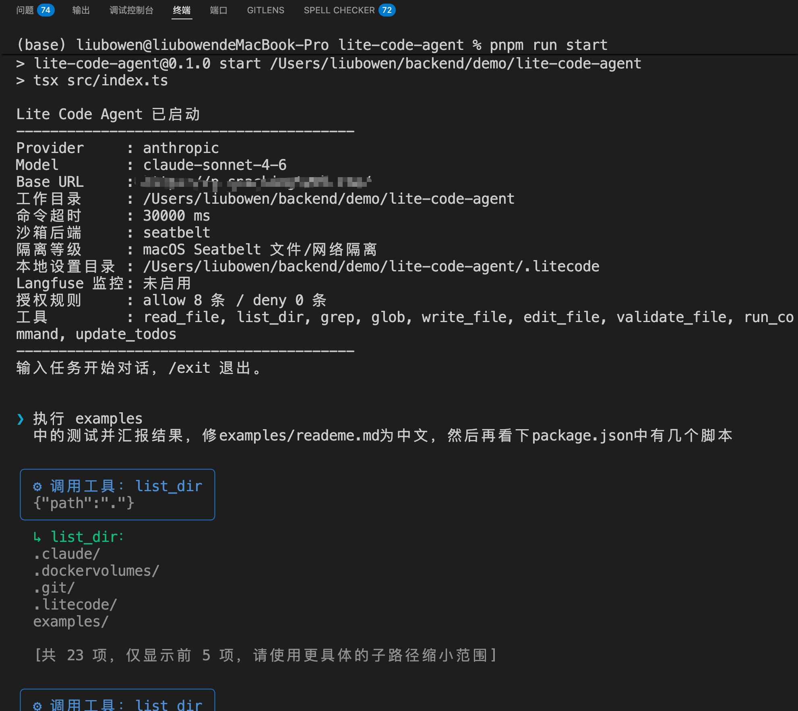
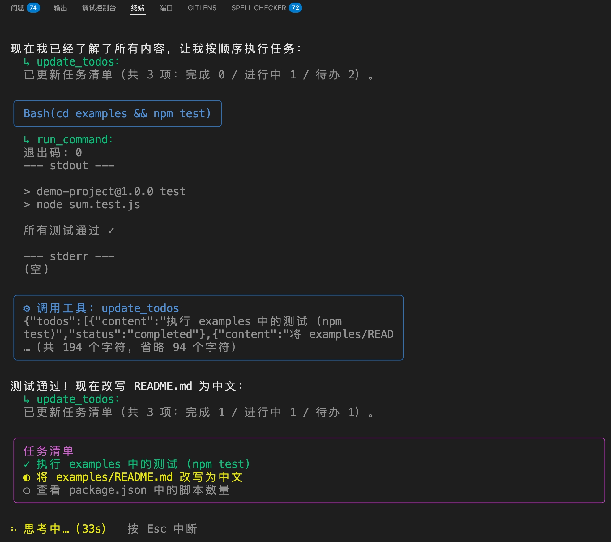
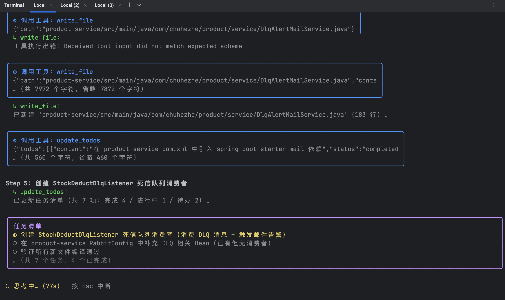

# Lite Code Agent

一个用于**学习 Agent 应用开发**的轻量级 code agent，参考 Claude Code 的核心交互模式，
用 **LangGraph + TypeScript** 实现。它在终端里与你对话，能读写本地文件、在受限沙箱中
执行命令和构建脚本，所有敏感操作都经过分级授权。

> ⚠️ **隔离强度**：沙箱基于**操作系统自带机制**（macOS Seatbelt / Linux bubblewrap /
> Windows 进程组）+ 工作目录白名单 + 超时 + 进程树终止 + 环境变量清洗实现，强于纯
> `child_process`，但**仍不等同于容器/VM 级强隔离**，不保证完全对抗恶意代码。缺少原生机制的
> 平台会自动降级为 `child_process` + 白名单 + 超时。详见下方「沙箱隔离」。

## 截图







## 特性

- 🔁 **LangGraph 主循环**：`StateGraph` 编排「思考 → 调用工具 → 观察 → 继续」的 ReAct 循环。
- 🧰 **工具集**：`read_file`（分页）、`list_dir`、`grep`/`glob`（只读搜索）、`write_file`、
  `edit_file`（diff 局部编辑）、`validate_file`（多语言编译/语法校验）、`run_command`（沙箱执行）、
  `update_todos`（任务清单）。
- 🔐 **分级授权 + 持久化**：read 免询问；write/execute 需授权；规则按 `工具名(参数模式)` 匹配，
  支持「始终允许/拒绝」并写入 `.litecode/settings.local.json`（参考 Claude Code）。
- 🖥️ **Ink 终端 UI**：回复按 Markdown 渲染富文本、块状渲染（已完成内容沉淀进终端 scrollback）、
  思考动画、todo 实时勾选（最多 3 条）、方向键选择授权、中文输入法光标跟随、`Esc` 中断。
- 🧱 **受限沙箱**：命令锁定工作目录、超时强杀、可被 `Esc` 中断（`AbortSignal` 贯穿）。
- 🔌 **可切换 Provider**：默认 Anthropic（支持 `apiKey` / `authToken` Bearer / `baseURL` / `model`），
  预留 OpenAI / Ollama 扩展点。
- 📊 **可选 Langfuse 监控**：配置即开，不配置不影响运行。

## 安装

需要 Node ≥ 22（Ink 7 要求）。

```bash
pnpm install
```

## 配置

凭证与运行参数从 **环境变量 / `.env`** 与 **`config.json`** 合并加载（优先级：环境变量 > config.json > 默认值）。

复制 `.env.example` 为 `.env`，填入凭证（二选一）：

```bash
# 方式一：官方 Anthropic，x-api-key
ANTHROPIC_API_KEY=sk-ant-xxxx
# 方式二：代理/网关（如 LiteLLM）或 Claude Code 习惯的 Bearer 方式
ANTHROPIC_AUTH_TOKEN=sk-xxxx
ANTHROPIC_BASE_URL=https://your-proxy/      # 可选，自定义网关
# LLM_MODEL=claude-sonnet-4-6               # 可选
# WORKDIR=./examples                        # 可选，agent 可操作的目录
```

结构化参数放 `config.json`（见 `config.example.json`）：

| 字段 | 说明 | 默认 |
|---|---|---|
| `workdir` | agent 可操作的目录（所有文件/命令限制在此） | 当前目录 |
| `commandTimeoutMs` | 命令执行超时（毫秒） | 30000 |
| `readFileMaxLines` | `read_file` 默认读取行数上限 | 2000 |
| `commandOutputMaxBytes` | `run_command` 输出字节预算 | 30720 |
| `maxIterations` | 主循环最大迭代次数 | 25 |

## 运行

```bash
pnpm start            # = tsx src/index.ts
pnpm typecheck        # tsc --noEmit
```

启动后进入 REPL：输入任务即可，`/exit` 退出。建议先把 `WORKDIR` 指到 `examples/` 练手：

```bash
WORKDIR=./examples pnpm start
```

## 架构

```
                  ┌──────────────────────── CLI (Ink) ────────────────────────┐
                  │  app.tsx  ←(events)── SessionController ──(submit)──► graph │
                  │   ▲ blocks / todos / auth / thinking      │                │
                  └───┼───────────────────────────────────────┼────────────────┘
                      │ 用户输入 / Esc / 方向键                 │ stream(updates)
                      │                                        ▼
                                              ┌──────────  StateGraph  ──────────┐
                                              │  agent 节点 ⇄ tools 节点（条件边） │
                                              └───────────────┬───────────────────┘
                                                              │ 执行前授权拦截
                                          ┌───────────────────┼───────────────────┐
                                          │ PermissionManager  │  9 个工具          │
                                          │ (allow/deny 匹配)   │  read/write/exec   │
                                          └────────┬───────────┴─────────┬──────────┘
                                          .litecode/settings.local.json   沙箱 (child_process)
```

**主循环**（`src/agent/graph.ts`）：状态含 `messages`（累积）、`iterations`（迭代保护）、
`todos`。`agent` 节点调用 LLM；若产生 `tool_calls` 则进 `tools` 节点，否则结束。`tools` 节点
对每个调用先过授权再执行，结果以 `ToolMessage` 回传，然后回到 `agent` 成环。

**授权**（`src/permissions/`）：`read` 默认放行；`write`/`execute` 先匹配规则
（`deny` 优先 → `allow` 免询问 → 都不命中则提示）。提示用方向键在
本次允许 / 本次拒绝 / 始终允许 / 始终拒绝 间选择，「始终」会把本次调用泛化成规则
（如 `run_command(npx tsc *)`）写入 `.litecode/settings.local.json`。

**沙箱**（`src/sandbox/`）：`detect` 按平台选隔离后端，`exec` 锁定 `cwd`，超时 `SIGKILL`，
支持外部 `AbortSignal`（`Esc` 中断时杀子进程）。

**UI 桥接**（`src/cli/controller.ts`）：`SessionController` 既是 `AuthPrompter`
（用 promise-bridge 把授权请求推给 UI 等按键），又用 `graph.stream` 把每步转成渲染块事件，
并跨轮累积对话历史。

## 沙箱隔离

`run_command` 在受限沙箱里执行。启动时按平台**自动探测**最强可用后端，缺失则**优雅降级**为 `none`
并打印告警（启动概览会显示「沙箱后端 / 隔离等级」）。

| 平台 | 后端 | 隔离能力 |
|---|---|---|
| macOS | `seatbelt`（`sandbox-exec`） | 文件写仅限白名单、可切断网络 |
| Linux | `bwrap`（bubblewrap） | mount/pid namespace，只读根 + 白名单可写、可切网；需 `apt/dnf install bubblewrap` |
| Windows | `jobobject` | 弱隔离：文件越界靠应用层白名单；建议在 **WSL2** 中运行获得 Linux 级隔离 |
| 其它/降级 | `none` | 仅 `cwd` 锁定 + 超时 + 进程树终止 + env 清洗 |

**与后端无关的通用加固**（各平台都生效）：

- **整棵进程树终止**：超时与 `Esc` 中断时，POSIX 杀进程组、Windows 用 `taskkill /T`，
  避免 `npm run` → `node` 等子进程残留。
- **环境变量清洗**：只把白名单内的变量（`PATH`/`HOME`/代理变量等）传给被执行命令，
  `ANTHROPIC_API_KEY`、`LANGFUSE_*` 等密钥**不会**泄漏给子进程。
- **资源限制**（POSIX）：按配置注入 `ulimit`（进程数 `-u` / CPU 时间 `-t` / 内存 `-v`），
  缺省不限制；`-u` 为 per-user 语义。

**配置**（`config.json` 的 `sandbox` 段或环境变量）：

```jsonc
{
  "sandbox": {
    "backend": "auto",          // auto | none | seatbelt | bwrap | jobobject
    "allowNetwork": true,        // 默认放行：npm install 等需联网；设 false 切断网络
    "writablePaths": [],         // 在 cwd + tmp + 包管理器缓存之外额外可写的绝对路径
    "limits": { "maxProcesses": 512, "cpuTimeSeconds": 60 },
    "envPassthrough": []         // 在默认白名单之外额外透传的环境变量名
  }
}
```

环境变量：`SANDBOX_BACKEND`、`SANDBOX_ALLOW_NETWORK`。

> **网络默认放行的权衡**：代码 agent 常需 `npm install` / 拉依赖，故 `allowNetwork` 默认 `true`。
> 若要在其中跑不可信代码，建议设为 `false` 切断网络，并配合 `seatbelt`/`bwrap` 后端。

## 工具一览

| 工具 | 级别 | 说明 |
|---|---|---|
| `read_file(path, offset?, limit?)` | read | 读取文件，分页，截断标注剩余 |
| `list_dir(path?)` | read | 列目录，目录排前，超量截断 |
| `grep(pattern, path?, ...)` | read | 按正则搜索文件内容 |
| `glob(pattern, path?)` | read | 按文件名模式查找文件 |
| `write_file(path, content)` | write | 创建/覆盖文件，授权前展示摘要 |
| `edit_file(path, old, new)` | write | 精确替换（`old` 须唯一），授权前展示 diff |
| `validate_file(path)` | read | 按扩展名校验编译/语法错误（TS/JS/Python/Ruby/Go/Java/Shell/JSON/YAML），缺校验器自动跳过 |
| `run_command(command)` | execute | 沙箱执行，超时/中断保护，头尾截断输出 |
| `update_todos(todos)` | read | 维护任务清单，UI 实时 ○/◐/✓ |

## 降低 token 消耗

多轮工具调用很费 token，本项目内置几项可选优化：

- **收紧系统提示**：指示模型不复述工具返回内容、不写大段解说、只给一句话级结论，减少**输出** token。
- **prompt caching**（`promptCaching`，默认关）：给系统提示加 `cache_control`，让 Anthropic 缓存
  「tools + system」这段稳定前缀，多轮命中缓存可显著省**输入** token。需 LLM 端点（官方或兼容网关，
  如 LiteLLM）支持 `cache_control`，不支持则被忽略、不报错；可在响应 `usage` 的
  `cache_read_input_tokens` / `cache_creation_input_tokens` 确认是否命中。
- **历史工具结果压缩**（`historyToolResultMaxBytes`，默认 8192，0=关）：重发给模型时把超预算的旧工具
  结果做头尾截断（产生当轮仍完整可见），削减多轮重发的输入 token。
- **对话历史自动压缩**（`historyCompactionMaxBytes`，默认 61440，0=关）：跨轮历史超过阈值时，提交前用
  LLM 把较旧历史摘要成精简上下文、保留最近若干轮，避免长会话撑爆 context window；压缩失败回退原历史。
- **工具输出预算可调**：`commandOutputMaxBytes` / `readFileMaxLines` 可调小。

> 概念澄清：①工具结果是**下一轮的输入 token**（非模型输出）；②工具调用参数是模型必需的输出，省不掉；
> ③模型每步的解说 prose 才是可省的输出 token；④多轮里重发全部历史是输入 token 大头，prompt caching
> 杠杆最大。**注意**：UI 里的展示裁剪（`clampCount`）**仅影响终端显示，不会减少发给模型的 token**——
> 两者是不同的东西。

配置（`config.json` 或环境变量 `PROMPT_CACHING` / `HISTORY_TOOL_RESULT_MAX_BYTES`）：

```jsonc
{
  "promptCaching": false,
  "historyToolResultMaxBytes": 8192
}
```

## 可选：Langfuse 监控

仓库内 `docker-compose.yml` 可一键自托管 Langfuse：

```bash
docker compose up -d            # 首次较慢，等各服务 healthy
# 浏览器打开 http://localhost:3000 注册 → 建项目 → 拿 public/secret key
```

把 key 填进 `.env`：

```bash
LANGFUSE_PUBLIC_KEY=pk-lf-xxxx
LANGFUSE_SECRET_KEY=sk-lf-xxxx
LANGFUSE_BASE_URL=http://localhost:3000
```

启动后每轮对话的 LLM 调用与工具执行链路会上报到 Langfuse。**不配置则自动关闭，不影响运行。**

## 目录结构

```
src/
  index.ts              入口：装配配置/模型/工具/控制器并启动 CLI
  config.ts             配置加载与校验
  provider.ts           LLM provider 工厂（默认 Anthropic）
  agent/                LangGraph 主循环（graph：agent/tools 节点 + 状态）/ 历史压缩（compaction）
  tools/                read_file / list_dir / grep / glob / write_file / edit_file / validate_file / run_command / update_todos
  permissions/          授权：settings 读写 / 规则匹配 / prompter / manager
  sandbox/              沙箱：types / detect（后端选择）/ policy / exec / backends（seatbelt·bwrap·windows·none）
  security/path.ts      工作目录路径白名单校验
  util/                 diff 格式化 / 输出头尾截断 / glob 匹配
  observability/langfuse.ts  可选 Langfuse 回调
  cli/                  Ink UI：app / controller / thinking / types / 输入框（promptInput·promptBuffer）/
                        历史（history）/ 任务清单摘要（todoSummary）/ Markdown 渲染（markdown）
examples/               示例工作目录（练手）
docker-compose.yml      本地自托管 Langfuse
```

## 学习要点

- LangGraph `StateGraph` 的状态/节点/条件边如何拼出 ReAct 循环。
- 工具调用循环 + human-in-the-loop 授权如何在 `tools` 节点内拦截。
- 用依赖注入（`AuthPrompter` 接口）把授权逻辑与界面解耦。
- `AbortSignal` 如何贯穿 图 → 工具 → 子进程实现中断。
- Ink/React 状态驱动渲染与命令式 agent 事件流如何通过 EventEmitter 桥接。
